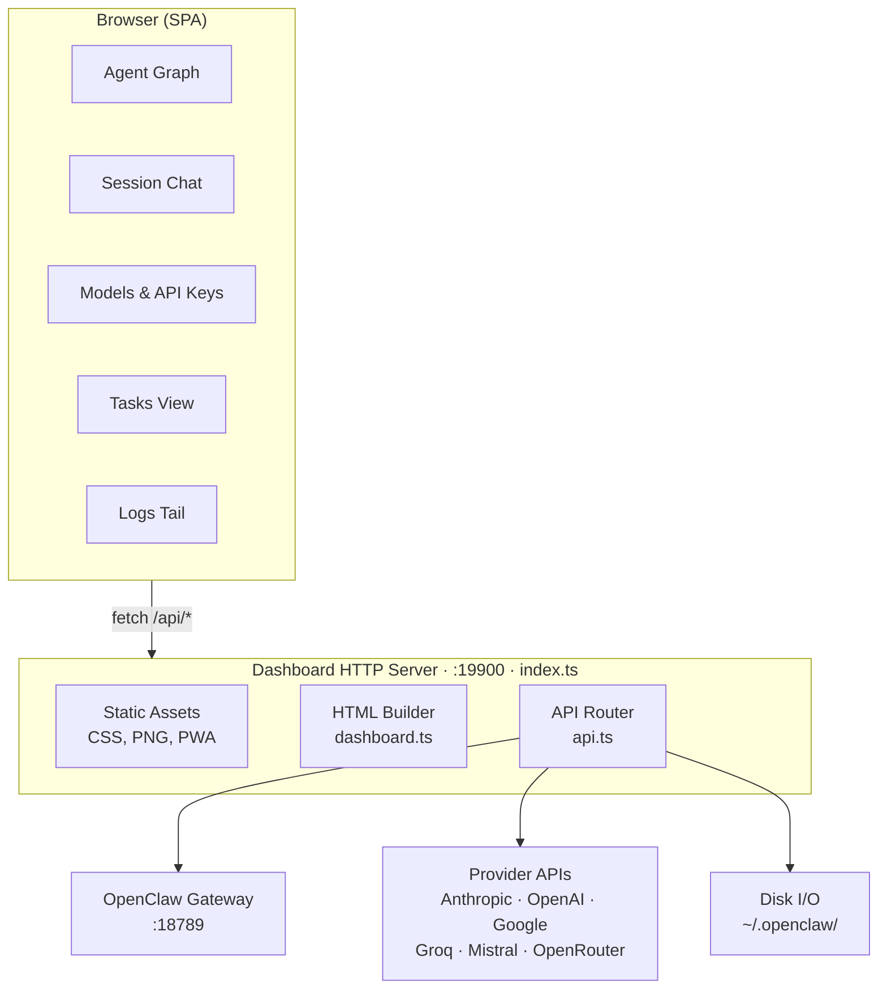

```
   ___                    ____ _
  / _ \ _ __   ___ _ __  / ___| | __ ___      __
 | | | | '_ \ / _ \ '_ \| |   | |/ _` \ \ /\ / /
 | |_| | |_) |  __/ | | | |___| | (_| |\ V  V /
  \___/| .__/ \___|_| |_|\____|_|\__,_| \_/\_/
       |_|        Agent Command Center v1.0
```

A standalone dashboard plugin for [OpenClaw](https://github.com/openclaw) — full
visibility and control over your agents, sessions, provider keys, channels, tasks,
and configuration from a single browser tab.


<table>
<tr>
<td></td>
<td></td>
</tr>
<tr>
<td></td>
<td></td>
</tr>
</table>

<details>
<summary>Mobile view</summary>

</details>

---

## Features

- Interactive relationship graph — pan, zoom, pinch-to-zoom on mobile
- Agent management — create, edit, delete, configure models, tools, workspace files
- Session chat — spawn sessions, send messages through the gateway
- Models & API status — live probe of every provider (keys, OAuth, rate limits, billing)
- Channels — Discord, Telegram, Slack, WhatsApp, Signal, and more
- Recurring tasks and heartbeat schedules with calendar views
- Raw JSON config editor with validation
- Live log tailing via SSE
- Health checks with dismissable banners
- PWA support — add to home screen on iOS/Android
- Fully responsive

---

## Architecture



## Source Layout

```
src/
├── index.ts              Entry point — HTTP server, static assets, plugin registration
├── api.ts                All /api/* route handlers
├── auth.ts               Authentication — credentials, sessions, login/setup pages
├── dashboard.ts          HTML builder — assembles the SPA shell
├── dashboard.js.txt      Client-side JS (vanilla, no framework) — inlined into HTML
├── dashboard.css         Styles — dark theme, responsive
├── resolve-asset.ts      Asset path resolver
├── index.test.ts         Vitest unit tests
├── favicon.png           Browser tab icon
├── logo.png              Header logo
└── ios_icon.png          PWA / iOS home screen icon
```

The dashboard exposes its own REST API under `/api/*` for scripting and integration.
See [API_REFERENCE.md](API_REFERENCE.md) for the full endpoint list.

---

## Installation

```bash
openclaw plugins install -l ./path/to/openclaw-agent-command-center   # link for dev
openclaw plugins install ./path/to/openclaw-agent-command-center      # copy-install
```

## Configuration

Add to `~/.openclaw/openclaw.json`:

```json
{
  "plugins": {
    "entries": {
      "agent-dashboard": {
        "enabled": true,
        "config": {
          "port": 19900,
          "title": "OpenClaw Command Center"
        }
      }
    }
  }
}
```

| Option           | Default                   | Description                                                                 |
|------------------|---------------------------|-----------------------------------------------------------------------------|
| `port`           | `19900`                   | HTTP port for the dashboard server                                          |
| `title`          | `OpenClaw Command Center` | Page title and PWA name                                                     |
| `allowedOrigins` | `[]`                      | Extra origins allowed to call the API (e.g. `["http://10.10.6.48:19900"]`)  |

Restart the gateway, then open **http://localhost:19900**.

---

## Security

On first load you'll be prompted to create a username and password (stored hashed with
scrypt in `~/.openclaw/extensions/openclaw-agent-dashboard/.credentials`). All subsequent
visits and API calls require authentication via session cookie or `Authorization: Bearer <token>`.

Cross-origin requests are blocked unless the origin is in `allowedOrigins`.

To reset credentials:

```bash
rm ~/.openclaw/extensions/openclaw-agent-dashboard/.credentials
```

---

## Development

```bash
npm install
npm run build      # compile TypeScript to dist/
npm run dev        # watch mode
npm test           # run vitest
```

CSS and client JS (`dashboard.css`, `dashboard.js.txt`) are served from `src/` at
runtime — changes don't require a rebuild, just a browser refresh. Only `*.ts` changes
need `tsc`.

---

## License

MIT
