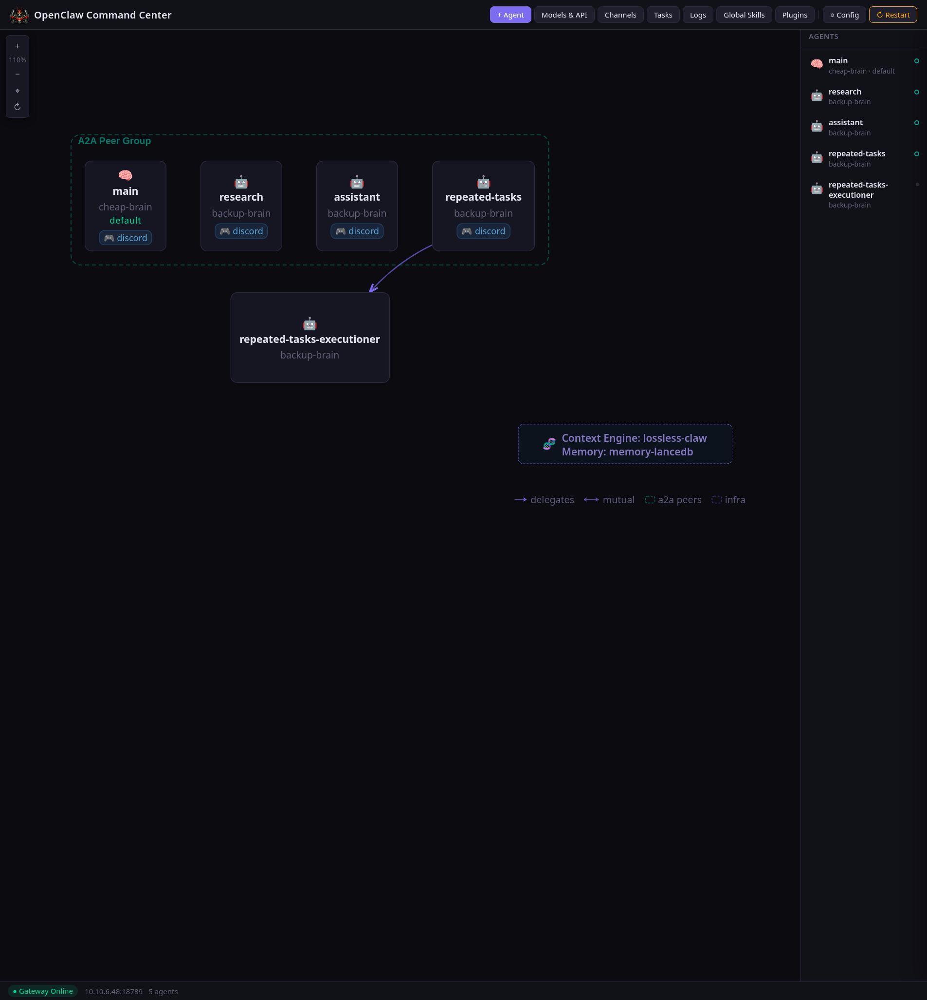
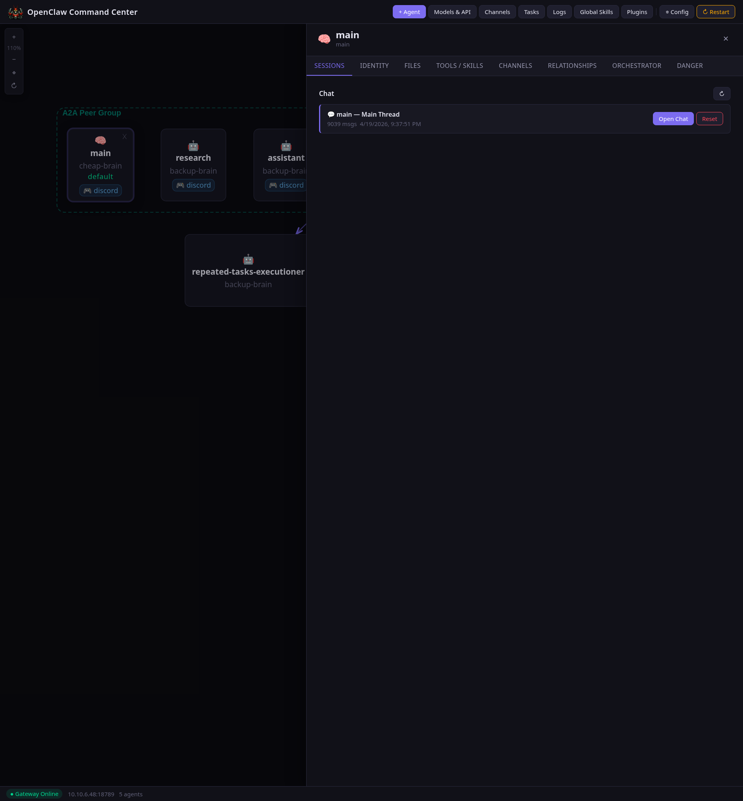
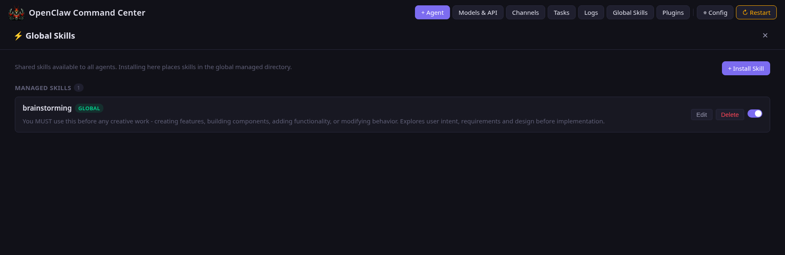
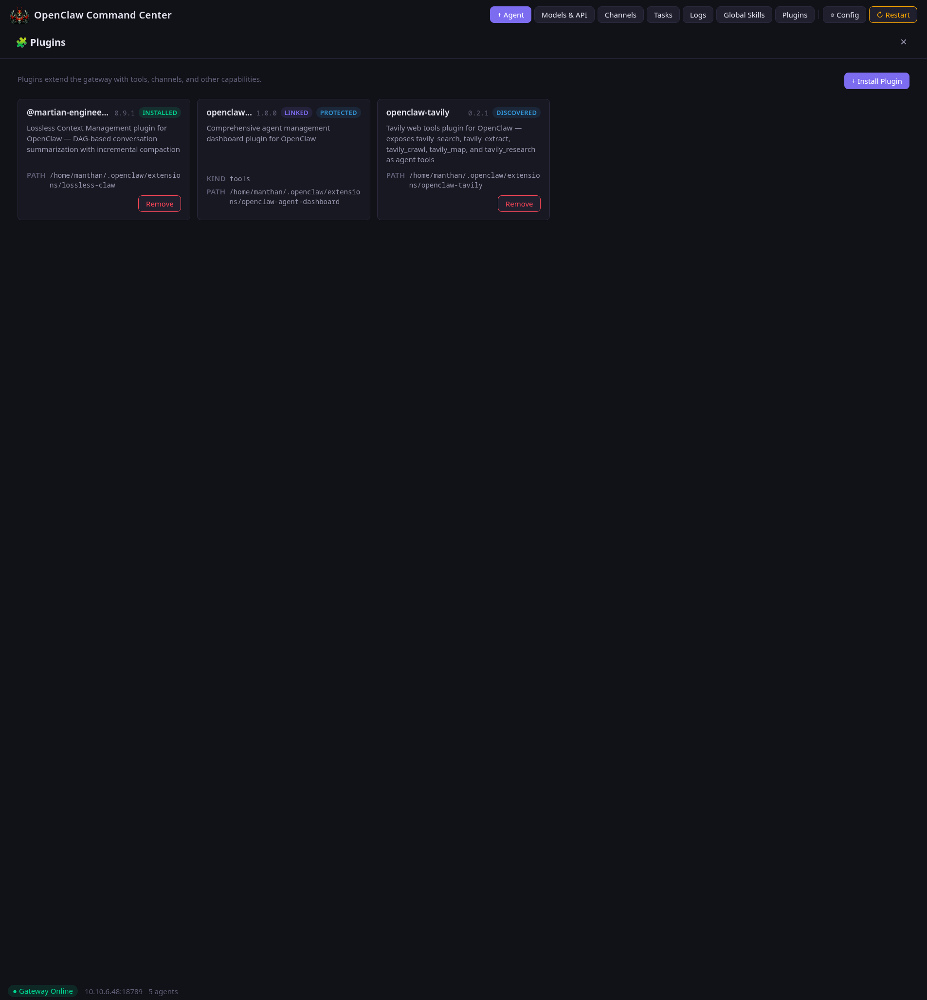

# OpenClaw Agent Command Center

OpenClaw’s browser dashboard for setting up, seeing, and managing your agents, workflows, skills, plugins, and config in one place.

It cuts down on gateway edits and config hunting by putting the most common OpenClaw actions in a single, visible browser UI. It is designed to work on desktop and mobile devices, so you can configure and manage OpenClaw from a phone or tablet too.



<table>
<tr>
<td></td>
<td></td>
</tr>
<tr>
<td></td>
<td></td>
</tr>
</table>

## Setup and use with OpenClaw

1. Install the plugin into your OpenClaw setup:
   ```bash
   # Link for local development
   openclaw plugins install -l ./path/to/openclaw-agent-command-center

   # Install from a local checkout
   openclaw plugins install ./path/to/openclaw-agent-command-center
   ```
2. If your install requires manual registration, add the plugin to `~/.openclaw/openclaw.json`:
   ```json
   {
     "plugins": {
       "allow": ["agent-dashboard"],
       "load": {
         "paths": ["/home/youruser/.openclaw/extensions/openclaw-agent-dashboard"]
       },
       "entries": {
         "agent-dashboard": {
           "enabled": true,
           "config": {
             "port": 19900,
             "title": "OpenClaw Command Center"
           }
         }
       }
     }
   }
   ```
3. Restart the OpenClaw gateway.
4. Open `http://localhost:19900` (port `19900` by default unless you change it in plugin config) and create your local username/password on first visit.

## What to do in the dashboard

- Start with the agent graph to see agents and relationships at a glance.
- Open an agent drawer to edit identity, tools, channels, files, relationships, and orchestrator settings.
- Manage channels, bindings, tasks, logs, and raw config from the browser.
- Use **Skills** to create, edit, enable, disable, or install per-agent and shared global skills.
- Use **Plugins** to view installed plugins and manage supported user-installed plugins.
- Batch config changes with the staged/deferred restart workflow.

## More docs

- [Skills Guide](docs/SKILLS.md)
- [Task Flow Orchestrator](docs/TASK_FLOW_ORCHESTRATOR.md)
- [API Reference](docs/API_REFERENCE.md)
- [Architecture](docs/ARCHITECTURE.md)
- [Setup & Configuration](docs/SETUP.md)
