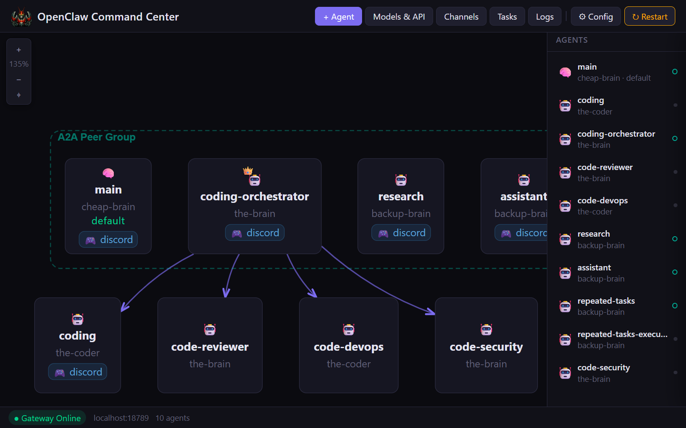

```
   ___                    ____ _
  / _ \ _ __   ___ _ __  / ___| | __ ___      __
 | | | | '_ \ / _ \ '_ \| |   | |/ _` \ \ /\ / /
 | |_| | |_) |  __/ | | | |___| | (_| |\ V  V /
  \___/| .__/ \___|_| |_|\____|_|\__,_| \_/\_/
       |_|        Agent Command Center v1.0
```

A dashboard plugin for [OpenClaw](https://github.com/openclaw) that gives you a single
place to manage your agents, chat sessions, channels, tasks, and multi-agent workflows —
all from your browser.


<table>
<tr>
<td></td>
<td></td>
</tr>
</table>

---

## What you can do

- See all your agents and how they connect in an interactive graph
- Create, edit, and delete agents and their configurations
- Chat with agents directly through the dashboard
- Monitor provider status and health across all your API keys
- Manage channels (Discord, Telegram, Slack, WhatsApp, Signal, and more)
- Schedule recurring tasks with calendar views
- Design and run multi-step agent pipelines with approval gates (Task Flow Orchestrator)
- Edit your raw JSON config with built-in validation
- Tail logs in real time
- Works on mobile — add it to your home screen as a PWA

---

## Quick start

1. Install the plugin:

```bash
openclaw plugins install ./path/to/openclaw-agent-command-center
```

2. Add it to your `~/.openclaw/openclaw.json`:

```json
{
  "plugins": {
    "entries": {
      "agent-dashboard": {
        "enabled": true,
        "config": {
          "port": 19900
        }
      }
    }
  }
}
```

3. Restart the gateway and open **http://localhost:19900**.

On first load you'll create a username and password. After that, every visit requires
login — your credentials are hashed and stored locally.

---

## Task Flow Orchestrator

The standout feature: chain multiple agents into repeatable pipelines. Define a flow
once, and the system handles step-by-step execution, state tracking, and human approval
gates automatically.

For example, a coding pipeline might look like:

```
User request → Coder agent → Code reviewer → Security audit → Deploy (requires approval)
```

Each step runs in sequence. If a step needs human sign-off, the flow pauses and waits
for you to approve or deny — either from the dashboard or through chat.

See the full guide: [Task Flow Orchestrator](docs/TASK_FLOW_ORCHESTRATOR.md)

---

## Documentation

| Document | What's in it |
|----------|-------------|
| [Setup & Configuration](docs/SETUP.md) | Installation, config options, security, development, project structure |
| [Architecture](docs/ARCHITECTURE.md) | How the dashboard works under the hood, data flow, source layout |
| [API Reference](docs/API_REFERENCE.md) | Every REST endpoint the dashboard exposes |
| [Task Flow Orchestrator](docs/TASK_FLOW_ORCHESTRATOR.md) | Multi-agent pipeline design, approval gates, agent setup |

---

## Development

```bash
npm install
npm run build      # compile TypeScript
npm test           # run tests
```

CSS and client JS are hot-reloadable — just refresh the browser. Only TypeScript changes
need a rebuild.

---

## Disclaimer

This plugin is provided as-is with no warranty. It reads and writes files under
`~/.openclaw/` including your main configuration. Back up your OpenClaw configuration
before installing or deploying.
