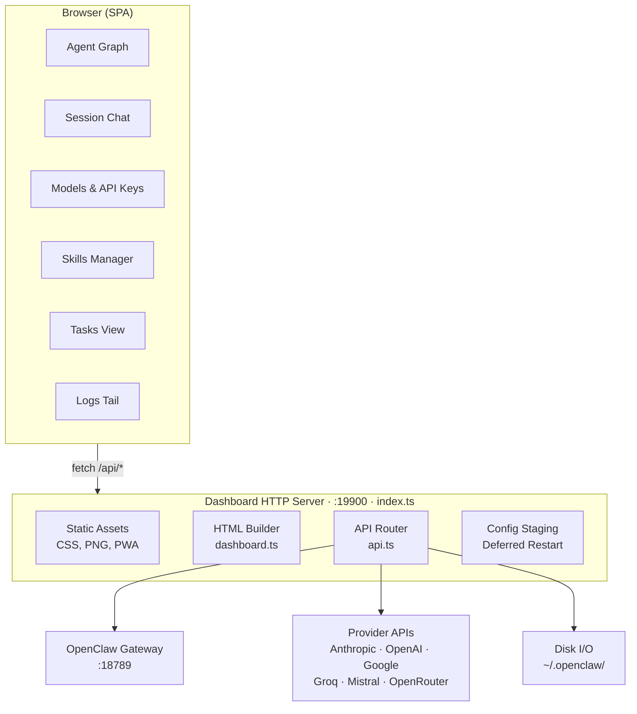

# Architecture

## Overview

The dashboard is a single-page application served by its own HTTP server that runs
as an OpenClaw plugin. It has no build-time frontend framework — the client-side JS
is vanilla JavaScript inlined into the HTML at serve time.



## How it works

1. The gateway loads the plugin from `dist/index.js` via `openclaw.plugin.json`.
   The manifest declares `"kind": "tools"` so the gateway wires up tool registrations.
2. `index.ts` starts a standalone HTTP server on the configured port (default 19900).
   The `register()` function is called once per agent — the HTTP server starts only on
   the first call, but `api.registerTool()` runs for every agent context.
3. On every request to `/`, `dashboard.ts` builds the full HTML page — it reads
   `dashboard.js.txt` (client JS) and inlines it into a `<script>` tag. CSS is served
   separately at `/dashboard.css` and read fresh from disk on each request.
4. The client JS calls `/api/overview` on load to fetch agents, config, sessions, and
   gateway status, then renders the relationship graph and agent list.
5. All mutations (create/edit/delete agents, update config, send messages) go through
   `/api/*` routes in `api.ts`, which read/write files under `~/.openclaw/` and proxy
   chat requests to the gateway at `:18789`.

## Deferred restart system

Config changes don't trigger immediate gateway restarts. Instead:

1. API endpoints accept `?defer=1` to stage changes in memory
2. The client sends all mutations with `?defer=1` by default
3. A persistent banner shows the pending change count
4. The user clicks "Apply & Restart" to commit all changes at once
5. `POST /api/config/commit` writes the staged config to disk, triggering one restart

This eliminates the wait-between-each-change friction. The raw config editor also
loads from the staged config when pending changes exist.

## Authentication

`auth.ts` handles credential storage and session management:

- Credentials are stored in `~/.openclaw/extensions/openclaw-agent-dashboard/.credentials`
  with passwords hashed using scrypt.
- Sessions are in-memory tokens with a 24-hour TTL, delivered via `HttpOnly` cookies.
- API clients can authenticate with `Authorization: Bearer <token>`.
- On first load with no credentials file, the setup page is shown.

## Source layout

```
src/
├── server/
│   ├── index.ts              Entry point — HTTP server, tool registration, service lifecycle
│   ├── api.ts                API route dispatcher
│   ├── api-utils.ts          Config I/O, staging, helpers
│   ├── auth.ts               Authentication — credentials, sessions, login/setup
│   ├── dashboard.ts          HTML builder — assembles the SPA shell
│   ├── resolve-asset.ts      Asset path resolver
│   └── routes/
│       ├── agents.ts         Agent CRUD, MD files, bindings
│       ├── config.ts         Config read/write/validate, staging endpoints
│       ├── sessions.ts       Session listing, chat, JSONL parsing
│       ├── skills.ts         Skill CRUD, SKILLS.md generation
│       ├── tasks.ts          Cron jobs, heartbeats, flow definitions
│       ├── providers.ts      Model provider scanning and status
│       ├── health.ts         Gateway and provider health checks
│       ├── tools.ts          Tool discovery and registry
│       ├── logs.ts           Log tailing and SSE streaming
│       ├── auth-profiles.ts  OAuth profile management
│       └── dashboard-ui.ts   Dashboard UI preferences
├── orchestrator/
│   ├── types.ts              Task flow type definitions
│   ├── utils.ts              Validation, tool ID helpers
│   └── codegen.ts            Flow definition file generation
└── assets/
    ├── dashboard.css         Stylesheet (dark theme, responsive)
    ├── dashboard.js.txt      Client-side JS (vanilla, no framework)
    ├── favicon.png           Browser tab icon
    ├── ios_icon.png          PWA / iOS home screen icon
    ├── login.css             Login page styles
    └── logo.png              Header logo
```

## Data flow

- **Config**: `~/.openclaw/openclaw.json` — read/written by the config editor.
  Changes are staged in memory until committed.
- **Agent state**: `~/.openclaw/agents/<id>/` — workspace markdown files, sessions
- **Skills**: `~/.openclaw/skills/` (managed/global) and
  `~/.openclaw/workspace-<id>/skills/` (per-agent)
- **Dashboard state**: `~/.openclaw/extensions/openclaw-agent-dashboard/` — dashboard
  config, session store, credentials, flow definitions, flow state, flow history
- **Provider probes**: API calls to Anthropic, OpenAI, Google, Groq, Mistral, OpenRouter
  to check key validity, rate limits, and available models

## Session file handling

Session JSONL files may use compound filenames like `{sessionId}-topic-{topicId}.jsonl`.
The session index scanner handles this by falling back to prefix matching when an exact
`{sessionId}.jsonl` file isn't found. Message timestamps from the JSONL entries are
attached to each message object for display in the chat view.
